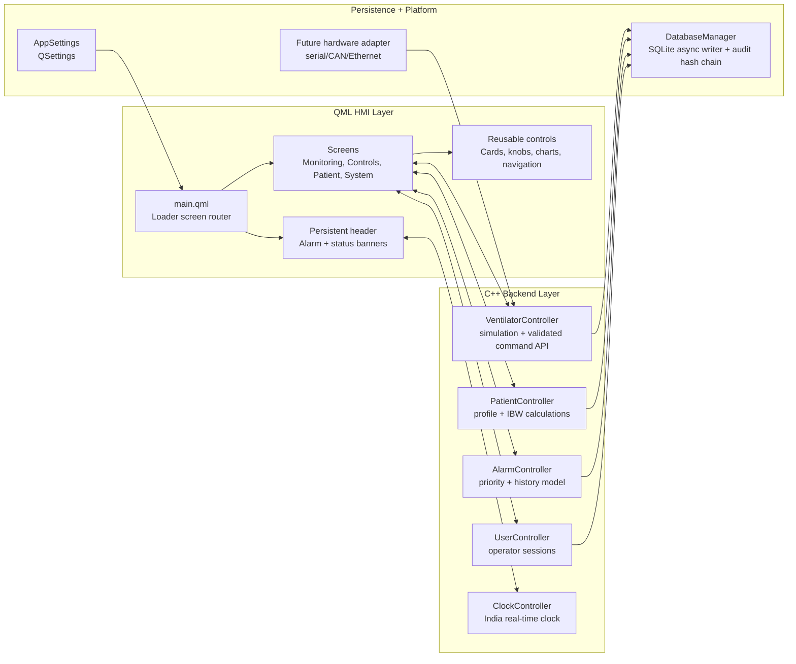

# Smart Ventilator and Respiratory Monitoring UI

A Qt/QML-based ICU ventilator user interface demonstration application built with
Qt 6.8. The project simulates a real-time respiratory monitoring system with
waveform visualization, patient management, alarm handling, and clinical parameter
controls. It is designed as a reference implementation for medical device UI
development, following separation of concerns between C++ backend controllers and
a declarative QML frontend.

Developed by Alsons Technology.

> This repository is a ventilator HMI simulator and architecture prototype. It is
> not cleared or validated for clinical use.


## Table of Contents

- [Overview](#overview)
- [Technology Stack](#technology-stack)
- [Project Structure](#project-structure)
- [Architecture](#architecture)
- [Screens](#screens)
- [Build Instructions](#build-instructions)
- [Configuration](#configuration)
- [Documentation Generation](#documentation-generation)
- [Embedded Deployment](#embedded-deployment)
- [Design Reference](#design-reference)
- [Qt Licensing](#qt-licensing)
- [Coding Standards](#coding-standards)
- [Medical Device Considerations](#medical-device-considerations)
- [License](#license)


## Overview

This application provides a fully navigable ventilator UI prototype with:

- Real-time waveform rendering for Pressure, Flow, Volume, and CO2 channels.
- Simulated patient vitals including SpO2, EtCO2, compliance, and resistance.
- Eight ventilation mode selections (ASV, SIMV, PCV, CPAP, BiPAP, PSV, PRVC, and related modes).
- Configurable patient profiles with calculated Ideal Body Weight, tidal volume, and respiratory rate.
- Active alarm management with critical, warning, and informational severity levels.
- Persistent settings through QSettings and SQLite database logging.
- Modular QML component library with centralized theming (colors, typography, spacing, radii).

The simulation engine in VentilatorController generates physiologically plausible
waveforms using sine-based modelling. In a production deployment, this simulation
layer would be replaced with a hardware adapter communicating over serial, CAN, or
Ethernet interfaces while keeping the QML-facing API contract unchanged.


## Technology Stack

| Layer         | Technology                              |
|---------------|-----------------------------------------|
| Language      | C++17, QML                              |
| Framework     | Qt 6.8 (QtQuick, QtQuickControls, QtSql)|
| Database      | SQLite (via Qt SQL module)              |
| Build System  | qmake (.pro file)                       |
| Documentation | Doxygen                                 |
| Style         | QtQuick Controls Basic style            |
| Target        | Desktop (1920x1080 primary, 1366x768 minimum) |


## Project Structure

```
MedicalProject/
|-- main.cpp                            Application entry point
|-- main.qml                            Root ApplicationWindow and screen router
|-- MedicalProject.pro                  qmake project configuration
|-- qml.qrc                            QML and asset resource manifest
|-- Doxyfile                            Doxygen configuration
|
|-- src/
|   |-- core/
|   |   |-- AppSettings.h/cpp          QSettings-based persistent preferences
|   |   |-- DatabaseManager.h/cpp      SQLite schema, read/write operations
|   |
|   |-- controllers/
|       |-- AlarmController.h/cpp      Alarm list model and banner state
|       |-- ClockController.h/cpp      Real-time clock (IST timezone)
|       |-- PatientController.h/cpp    Patient demographics and calculations
|       |-- VentilatorController.h/cpp Simulation engine, waveform buffers, alarm evaluation
|
|-- qml/
|   |-- styles/
|   |   |-- Colors.qml                 Color palette singleton
|   |   |-- Typography.qml             Font family and size scale singleton
|   |   |-- Spacing.qml                Layout spacing and margin singleton
|   |   |-- Radius.qml                 Border radius singleton
|   |   |-- qmldir                     QML module registration
|   |
|   |-- components/
|   |   |-- buttons/
|   |   |   |-- PrimaryButton.qml      Styled action button
|   |   |   |-- PrefsTabButton.qml     Tab toggle button
|   |   |
|   |   |-- indicators/
|   |   |   |-- AppHeader.qml          Top bar (mode, patient, clock, alarms)
|   |   |   |-- AlarmBanner.qml        Critical/warning notification banner
|   |   |   |-- DateTimeBanner.qml     Clock and status icon display
|   |   |
|   |   |-- cards/
|   |   |   |-- Panel.qml              Generic styled container
|   |   |   |-- MetricTile.qml         Numeric value display tile
|   |   |   |-- ModeCard.qml           Ventilation mode selection card
|   |   |   |-- StatusPanel.qml        Mode and patient category display
|   |   |
|   |   |-- charts/
|   |   |   |-- WaveformChart.qml      Canvas-based real-time waveform
|   |   |   |-- TrendChart.qml         Trend line wrapper
|   |   |   |-- CircularKnob.qml       Rotary parameter knob
|   |   |   |-- PressureControl.qml    Circular pressure gauge
|   |   |   |-- PressureGroupBox.qml   Gauge with increment/decrement controls
|   |   |   |-- CurvedSideButton.qml   Curved side button for gauge controls
|   |   |
|   |   |-- navigation/
|   |       |-- BottomNavigation.qml   Eight-tab bottom navigation bar
|   |
|   |-- screens/
|   |   |-- SplashScreen.qml           Boot animation with progress indicator
|   |   |-- StandbyScreen.qml          Patient selection and calibration
|   |   |-- PatientSetupScreen.qml     Age, height, weight configuration
|   |   |-- ModeSelectionScreen.qml    Ventilation mode grid
|   |   |-- MonitoringScreen.qml       Live waveforms and vital metrics
|   |   |-- ControlsScreen.qml         Parameter controls (5 sections)
|   |   |-- AlarmCenterScreen.qml      Alarm table with history
|   |   |-- EventsScreen.qml           Event timeline
|   |   |-- SystemDiagnosticsScreen.qml System info, tests, sensors, settings
|   |   |-- ToolsScreen.qml            Utility gauges and alarm log
|   |   |-- LayoutScreen.qml           Layout preset selection
|   |
|   |-- assets/
|       |-- icons/                     SVG and PNG icons
|
|-- docs/
    |-- SCREEN_FLOW_TODO.md            Screen flow documentation and feature roadmap
    |-- PROJECT_STATUS.md              Detailed project status and issue tracker
```


## Architecture

The application follows a controller-view architecture:



**C++ controllers** are registered as QML context properties in main.cpp. Each
controller is a QObject subclass exposing Q_PROPERTY bindings and Q_INVOKABLE
methods. QML components bind directly to controller properties for reactive
updates.

**Screen routing** is handled by an asynchronous Loader in main.qml. The
`currentScreen` property selects which Component to load. The bottom navigation
bar, clinical alarm banner, and non-clinical system status banner remain
persistent across all operating screens.

**Style system** uses four QML singletons (Colors, Typography, Spacing, Radius)
registered via qmldir. All visual properties should reference these singletons
rather than using hardcoded values.

**Data persistence** is split between QSettings (user preferences like
brightness, volume, language) and SQLite (alarm history, ventilator snapshots,
operator audit events, patient profile changes). DatabaseManager handles schema
creation, compatibility migrations, asynchronous writes, and a tamper-evident
event hash chain.

**Build metadata** comes from qmake defines. CI should pass `APP_VERSION` and
`BUILD_ID` environment variables before running qmake. Local builds default to
`0.1.0-dev` and `local`.


## Screens

| Screen                    | File                          | Description                                          |
|---------------------------|-------------------------------|------------------------------------------------------|
| Splash                    | SplashScreen.qml              | Boot animation with Alsons Technology branding        |
| Standby                   | StandbyScreen.qml             | Patient selection, gender, presets, calibration       |
| Patient Setup             | PatientSetupScreen.qml        | Configure age, height, weight; shows calculated IBW   |
| Mode Selection            | ModeSelectionScreen.qml       | Grid of 8 ventilation modes                          |
| Active Monitoring         | MonitoringScreen.qml          | Live waveforms, vitals, lung visualization           |
| Controls                  | ControlsScreen.qml            | Basic, Patient, Advanced, Alarm Limits, Apnea tabs   |
| Alarm Center              | AlarmCenterScreen.qml         | Alarm table with severity and acknowledge actions     |
| Events                    | EventsScreen.qml              | Timeline of mode changes, parameter edits, alarms    |
| System Diagnostics        | SystemDiagnosticsScreen.qml   | Device info, self-test, sensors, settings             |
| Tools                     | ToolsScreen.qml               | Utility gauges and alarm log across 3 pages           |
| Layout                    | LayoutScreen.qml              | Select monitoring layout presets                      |


## Build Instructions

### Prerequisites

- Qt 6.8 or later (with QtQuick, QtQuickControls2, and QtSql modules)
- C++17 compatible compiler (GCC 9+, Clang 10+, MSVC 2019+)
- qmake (included with Qt installation)

### Build Steps

```bash
# Clone the repository
git clone <repository-url>
cd MedicalProject

# Create a build directory
mkdir build && cd build

# Run qmake (adjust path to your Qt installation)
qmake ../MedicalProject.pro

# Build
make -j$(nproc)

# Run
./MedicalProject
```

To inject build metadata:

```bash
APP_VERSION=1.2.0 BUILD_ID="$GIT_COMMIT" qmake ../MedicalProject.pro
make -j$(nproc)
```

### macOS

```bash
mkdir build && cd build
/path/to/Qt/6.8.x/macos/bin/qmake ../MedicalProject.pro
make -j$(sysctl -n hw.ncpu)
open MedicalProject.app
```

### Windows (MSVC)

```cmd
mkdir build && cd build
C:\Qt\6.8.x\msvc2019_64\bin\qmake ..\MedicalProject.pro
nmake
MedicalProject.exe
```


## Configuration

Application settings are persisted through QSettings under the organization
"AlsonsTechnology" and application name "SmartVentilatorDemo". Configurable
values include:

| Setting           | Type    | Default | Description                    |
|-------------------|---------|---------|--------------------------------|
| softwareVersion   | QString | "1.0.0" | Read-only software identifier  |
| operatingHours    | double  | 0.0     | Accumulated runtime hours      |
| brightness        | int     | 80      | Display brightness (0-100)     |
| audioVolume       | int     | 50      | Audio level (0-100)            |
| language          | QString | "en"    | UI language code               |


## Documentation Generation

The project includes a Doxyfile for generating API documentation from source
code comments.

```bash
# Generate HTML documentation
doxygen Doxyfile

# Open generated docs
open docs/html/index.html
```


## Embedded Deployment

Deployment starter files are provided under `deploy/`:

- `deploy/systemd/smart-ventilator-ui.service` for supervised embedded launch.
- `deploy/yocto/smart-ventilator-ui.bb` as a Qt 6 Yocto recipe template.
- `docs/EMBEDDED_DEPLOYMENT.md` for filesystem, watchdog, and runtime safety notes.


## Design Reference

The UI design is based on the Smart Ventilator and Respiratory Monitoring UI
concept by Tahir Moosani. The full design specification can be viewed at:

https://www.behance.net/gallery/211931131/Smart-Ventilator-Respiratory-Monitoring-UI

Key design principles from the reference:
- Dark theme with blue accent palette for reduced eye strain in ICU environments.
- High-contrast text for readability under variable lighting conditions.
- Large touch targets for gloved-hand operation.
- Clear visual hierarchy separating waveforms, vitals, and controls.
- Color-coded severity levels for alarm states.


## Qt Licensing

Qt module and licensing considerations are tracked in `docs/QT_LICENSING_NOTES.md`.
A closed medical embedded product should complete a formal Qt LGPL/commercial
licensing review before release.


## Coding Standards

### QML

- Use Qt 6 versionless imports (e.g., `import QtQuick` not `import QtQuick 2.15`).
- Reference style singletons (Colors, Typography, Spacing, Radius) for all visual values.
- Add `pragma ComponentBehavior: Bound` to files using delegates or Repeaters.
- Maximum line length: 120 characters.
- Use 4-space indentation throughout.
- Order QML properties: id, required properties, custom properties, signals, signal handlers, functions, child items.
- Document component interfaces with header comments.

### C++

- Use `#pragma once` for header guards.
- Follow Qt naming conventions (camelCase for methods, m_ prefix for member variables).
- Document public API with Doxygen comments (`@brief`, `@param`, `@return`).
- Use `QStringLiteral` for compile-time string construction.
- Validate all external inputs with `qBound` in property setters.


## Medical Device Considerations

This is a demonstration application and is not certified for clinical use. A
production medical ventilator UI would require additional compliance work
including but not limited to:

- IEC 62304: Medical device software lifecycle processes.
- IEC 60601-1-8: Alarm system requirements for priority, escalation, and silence timing.
- IEC 62366-1: Usability engineering for medical devices.
- FDA 21 CFR Part 11: Electronic records and audit trail requirements.
- WCAG 2.1 AA: Accessibility including color-blind safe indicators.
- Risk management per ISO 14971 with documented hazard analysis.
- Minimum touch target sizes of 44x44 pixels for gloved operation.
- Screen lock and operator authentication for clinical environments.
- Tamper-proof audit trail logging for all parameter changes and alarm events.

See docs/PROJECT_STATUS.md for the current compliance gap analysis and
implementation roadmap.


## License

Copyright Alsons Technology. All rights reserved.
