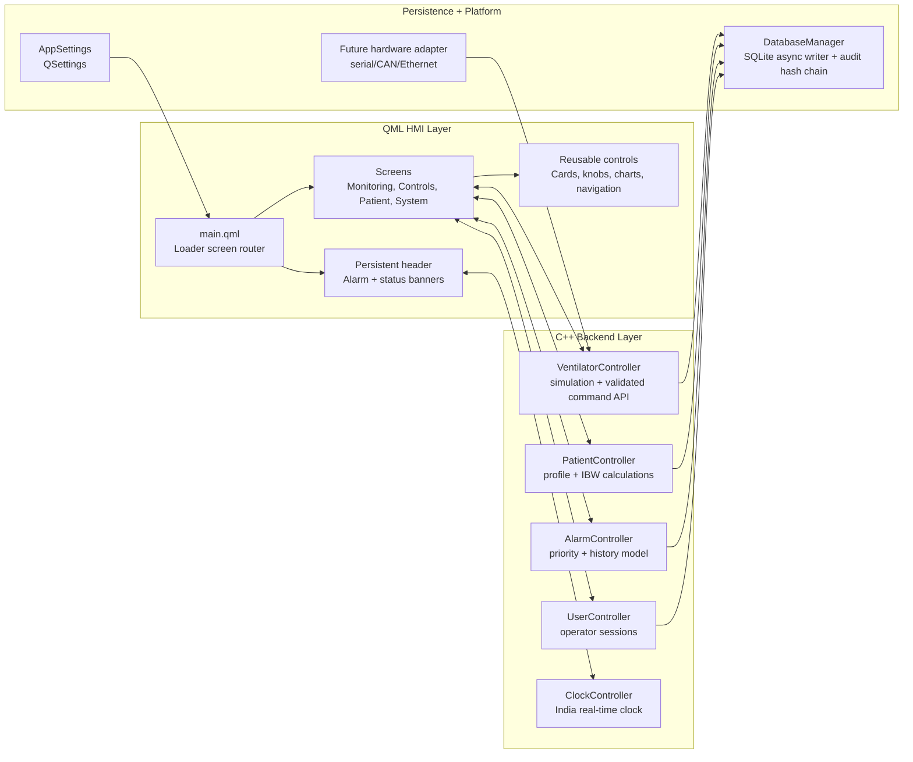

# Smart Ventilator and Respiratory Monitoring UI

A Qt/QML-based ICU ventilator user interface demonstration application built with
Qt 6.8. The project simulates a real-time respiratory monitoring system with
waveform visualization, patient management, alarm handling, and clinical parameter
controls. It is designed as a reference implementation for medical device UI
development, following separation of concerns between C++ backend controllers and
a declarative QML frontend.

Developed by Alsons Technology.

> This repository is a ventilator HMI simulator and architecture prototype. It is
> not cleared or validated for clinical use.


## Table of Contents

- [Overview](#overview)
- [Technology Stack](#technology-stack)
- [Project Structure](#project-structure)
- [Architecture](#architecture)
- [Screens](#screens)
- [Build Instructions](#build-instructions)
- [Configuration](#configuration)
- [Documentation Generation](#documentation-generation)
- [Embedded Deployment](#embedded-deployment)
- [Design Reference](#design-reference)
- [Qt Licensing](#qt-licensing)
- [Coding Standards](#coding-standards)
- [Medical Device Considerations](#medical-device-considerations)
- [License](#license)


## Overview

This application provides a fully navigable ventilator UI prototype with:

- Real-time waveform rendering for Pressure, Flow, Volume, and CO2 channels.
- Simulated patient vitals including SpO2, EtCO2, compliance, and resistance.
- Eight ventilation mode selections (ASV, SIMV, PCV, CPAP, BiPAP, PSV, PRVC, and related modes).
- Configurable patient profiles with calculated Ideal Body Weight, tidal volume, and respiratory rate.
- Active alarm management with critical, warning, and informational severity levels.
- Persistent settings through QSettings and SQLite database logging.
- Modular QML component library with centralized theming (colors, typography, spacing, radii).

The simulation engine in VentilatorController generates physiologically plausible
waveforms using sine-based modelling. In a production deployment, this simulation
layer would be replaced with a hardware adapter communicating over serial, CAN, or
Ethernet interfaces while keeping the QML-facing API contract unchanged.


## Technology Stack

| Layer         | Technology                              |
|---------------|-----------------------------------------|
| Language      | C++17, QML                              |
| Framework     | Qt 6.8 (QtQuick, QtQuickControls, QtSql)|
| Database      | SQLite (via Qt SQL module)              |
| Build System  | qmake (.pro file)                       |
| Documentation | Doxygen                                 |
| Style         | QtQuick Controls Basic style            |
| Target        | Desktop (1920x1080 primary, 1366x768 minimum) |


## Project Structure

```
MedicalProject/
|-- main.cpp                            Application entry point
|-- main.qml                            Root ApplicationWindow and screen router
|-- MedicalProject.pro                  qmake project configuration
|-- qml.qrc                            QML and asset resource manifest
|-- Doxyfile                            Doxygen configuration
|
|-- src/
|   |-- core/
|   |   |-- AppSettings.h/cpp          QSettings-based persistent preferences
|   |   |-- DatabaseManager.h/cpp      SQLite schema, read/write operations
|   |
|   |-- controllers/
|       |-- AlarmController.h/cpp      Alarm list model and banner state
|       |-- ClockController.h/cpp      Real-time clock (IST timezone)
|       |-- PatientController.h/cpp    Patient demographics and calculations
|       |-- VentilatorController.h/cpp Simulation engine, waveform buffers, alarm evaluation
|
|-- qml/
|   |-- styles/
|   |   |-- Colors.qml                 Color palette singleton
|   |   |-- Typography.qml             Font family and size scale singleton
|   |   |-- Spacing.qml                Layout spacing and margin singleton
|   |   |-- Radius.qml                 Border radius singleton
|   |   |-- qmldir                     QML module registration
|   |
|   |-- components/
|   |   |-- buttons/
|   |   |   |-- PrimaryButton.qml      Styled action button
|   |   |   |-- PrefsTabButton.qml     Tab toggle button
|   |   |
|   |   |-- indicators/
|   |   |   |-- AppHeader.qml          Top bar (mode, patient, clock, alarms)
|   |   |   |-- AlarmBanner.qml        Critical/warning notification banner
|   |   |   |-- DateTimeBanner.qml     Clock and status icon display
|   |   |
|   |   |-- cards/
|   |   |   |-- Panel.qml              Generic styled container
|   |   |   |-- MetricTile.qml         Numeric value display tile
|   |   |   |-- ModeCard.qml           Ventilation mode selection card
|   |   |   |-- StatusPanel.qml        Mode and patient category display
|   |   |
|   |   |-- charts/
|   |   |   |-- WaveformChart.qml      Canvas-based real-time waveform
|   |   |   |-- TrendChart.qml         Trend line wrapper
|   |   |   |-- CircularKnob.qml       Rotary parameter knob
|   |   |   |-- PressureControl.qml    Circular pressure gauge
|   |   |   |-- PressureGroupBox.qml   Gauge with increment/decrement controls
|   |   |   |-- CurvedSideButton.qml   Curved side button for gauge controls
|   |   |
|   |   |-- navigation/
|   |       |-- BottomNavigation.qml   Eight-tab bottom navigation bar
|   |
|   |-- screens/
|   |   |-- SplashScreen.qml           Boot animation with progress indicator
|   |   |-- StandbyScreen.qml          Patient selection and calibration
|   |   |-- PatientSetupScreen.qml     Age, height, weight configuration
|   |   |-- ModeSelectionScreen.qml    Ventilation mode grid
|   |   |-- MonitoringScreen.qml       Live waveforms and vital metrics
|   |   |-- ControlsScreen.qml         Parameter controls (5 sections)
|   |   |-- AlarmCenterScreen.qml      Alarm table with history
|   |   |-- EventsScreen.qml           Event timeline
|   |   |-- SystemDiagnosticsScreen.qml System info, tests, sensors, settings
|   |   |-- ToolsScreen.qml            Utility gauges and alarm log
|   |   |-- LayoutScreen.qml           Layout preset selection
|   |
|   |-- assets/
|       |-- icons/                     SVG and PNG icons
|
|-- docs/
    |-- SCREEN_FLOW_TODO.md            Screen flow documentation and feature roadmap
    |-- PROJECT_STATUS.md              Detailed project status and issue tracker
```


## Architecture

The application follows a controller-view architecture:



**C++ controllers** are registered as QML context properties in main.cpp. Each
controller is a QObject subclass exposing Q_PROPERTY bindings and Q_INVOKABLE
methods. QML components bind directly to controller properties for reactive
updates.

**Screen routing** is handled by an asynchronous Loader in main.qml. The
`currentScreen` property selects which Component to load. The bottom navigation
bar, clinical alarm banner, and non-clinical system status banner remain
persistent across all operating screens.

**Style system** uses four QML singletons (Colors, Typography, Spacing, Radius)
registered via qmldir. All visual properties should reference these singletons
rather than using hardcoded values.

**Data persistence** is split between QSettings (user preferences like
brightness, volume, language) and SQLite (alarm history, ventilator snapshots,
operator audit events, patient profile changes). DatabaseManager handles schema
creation, compatibility migrations, asynchronous writes, and a tamper-evident
event hash chain.

**Build metadata** comes from qmake defines. CI should pass `APP_VERSION` and
`BUILD_ID` environment variables before running qmake. Local builds default to
`0.1.0-dev` and `local`.


## Screens

| Screen                    | File                          | Description                                          |
|---------------------------|-------------------------------|------------------------------------------------------|
| Splash                    | SplashScreen.qml              | Boot animation with Alsons Technology branding        |
| Standby                   | StandbyScreen.qml             | Patient selection, gender, presets, calibration       |
| Patient Setup             | PatientSetupScreen.qml        | Configure age, height, weight; shows calculated IBW   |
| Mode Selection            | ModeSelectionScreen.qml       | Grid of 8 ventilation modes                          |
| Active Monitoring         | MonitoringScreen.qml          | Live waveforms, vitals, lung visualization           |
| Controls                  | ControlsScreen.qml            | Basic, Patient, Advanced, Alarm Limits, Apnea tabs   |
| Alarm Center              | AlarmCenterScreen.qml         | Alarm table with severity and acknowledge actions     |
| Events                    | EventsScreen.qml              | Timeline of mode changes, parameter edits, alarms    |
| System Diagnostics        | SystemDiagnosticsScreen.qml   | Device info, self-test, sensors, settings             |
| Tools                     | ToolsScreen.qml               | Utility gauges and alarm log across 3 pages           |
| Layout                    | LayoutScreen.qml              | Select monitoring layout presets                      |


## Build Instructions

### Prerequisites

- Qt 6.8 or later (with QtQuick, QtQuickControls2, and QtSql modules)
- C++17 compatible compiler (GCC 9+, Clang 10+, MSVC 2019+)
- qmake (included with Qt installation)

### Build Steps

```bash
# Clone the repository
git clone <repository-url>
cd MedicalProject

# Create a build directory
mkdir build && cd build

# Run qmake (adjust path to your Qt installation)
qmake ../MedicalProject.pro

# Build
make -j$(nproc)

# Run
./MedicalProject
```

To inject build metadata:

```bash
APP_VERSION=1.2.0 BUILD_ID="$GIT_COMMIT" qmake ../MedicalProject.pro
make -j$(nproc)
```

### macOS

```bash
mkdir build && cd build
/path/to/Qt/6.8.x/macos/bin/qmake ../MedicalProject.pro
make -j$(sysctl -n hw.ncpu)
open MedicalProject.app
```

### Windows (MSVC)

```cmd
mkdir build && cd build
C:\Qt\6.8.x\msvc2019_64\bin\qmake ..\MedicalProject.pro
nmake
MedicalProject.exe
```


## Configuration

Application settings are persisted through QSettings under the organization
"AlsonsTechnology" and application name "SmartVentilatorDemo". Configurable
values include:

| Setting           | Type    | Default | Description                    |
|-------------------|---------|---------|--------------------------------|
| softwareVersion   | QString | "1.0.0" | Read-only software identifier  |
| operatingHours    | double  | 0.0     | Accumulated runtime hours      |
| brightness        | int     | 80      | Display brightness (0-100)     |
| audioVolume       | int     | 50      | Audio level (0-100)            |
| language          | QString | "en"    | UI language code               |


## Documentation Generation

The project includes a Doxyfile for generating API documentation from source
code comments.

```bash
# Generate HTML documentation
doxygen Doxyfile

# Open generated docs
open docs/html/index.html
```


## Embedded Deployment

Deployment starter files are provided under `deploy/`:

- `deploy/systemd/screenshots-ui.service` for supervised embedded launch.
- `deploy/yocto/screenshots-ui.bb` as a Qt 6 Yocto recipe template.
- `docs/EMBEDDED_DEPLOYMENT.md` for filesystem, watchdog, and runtime safety notes.


## Design Reference

The UI design is based on the Smart Ventilator and Respiratory Monitoring UI
concept by Tahir Moosani. The full design specification can be viewed at:

https://www.behance.net/gallery/211931131/screenshots-Respiratory-Monitoring-UI

Key design principles from the reference:
- Dark theme with blue accent palette for reduced eye strain in ICU environments.
- High-contrast text for readability under variable lighting conditions.
- Large touch targets for gloved-hand operation.
- Clear visual hierarchy separating waveforms, vitals, and controls.
- Color-coded severity levels for alarm states.


## Qt Licensing

Qt module and licensing considerations are tracked in `docs/QT_LICENSING_NOTES.md`.
A closed medical embedded product should complete a formal Qt LGPL/commercial
licensing review before release.


## Coding Standards

### QML

- Use Qt 6 versionless imports (e.g., `import QtQuick` not `import QtQuick 2.15`).
- Reference style singletons (Colors, Typography, Spacing, Radius) for all visual values.
- Add `pragma ComponentBehavior: Bound` to files using delegates or Repeaters.
- Maximum line length: 120 characters.
- Use 4-space indentation throughout.
- Order QML properties: id, required properties, custom properties, signals, signal handlers, functions, child items.
- Document component interfaces with header comments.

### C++

- Use `#pragma once` for header guards.
- Follow Qt naming conventions (camelCase for methods, m_ prefix for member variables).
- Document public API with Doxygen comments (`@brief`, `@param`, `@return`).
- Use `QStringLiteral` for compile-time string construction.
- Validate all external inputs with `qBound` in property setters.


## Medical Device Considerations

This is a demonstration application and is not certified for clinical use. A
production medical ventilator UI would require additional compliance work
including but not limited to:

- IEC 62304: Medical device software lifecycle processes.
- IEC 60601-1-8: Alarm system requirements for priority, escalation, and silence timing.
- IEC 62366-1: Usability engineering for medical devices.
- FDA 21 CFR Part 11: Electronic records and audit trail requirements.
- WCAG 2.1 AA: Accessibility including color-blind safe indicators.
- Risk management per ISO 14971 with documented hazard analysis.
- Minimum touch target sizes of 44x44 pixels for gloved operation.
- Screen lock and operator authentication for clinical environments.
- Tamper-proof audit trail logging for all parameter changes and alarm events.

See docs/PROJECT_STATUS.md for the current compliance gap analysis and
implementation roadmap.

## Smart Ventilator Project Screens

The `public/screenshots` folder contains the complete ICU Smart Ventilator UI screen set. This project is a Qt/QML clinical HMI concept for a bedside ventilator: it covers startup checks, secure operator access, patient setup, live waveform monitoring, alarms, trends, therapy tools, weaning support, clinical records, export, maintenance, and device settings.

The design is built around a simple idea: an ICU operator should always know what mode the device is in, who the patient is, what alarm is active, and where to go next. Critical actions stay visible in the header, while the bottom navigation keeps the main workflows predictable.

Project demo video: [Smart ICU Ventilator UI on YouTube](https://www.youtube.com/watch?v=Ozvt5mGjdJA)

### 1. Boot Self-Check


The ventilator opens with a branded startup screen for Alsons Technology. It shows sensor-check progress, software version, and total operating hours, which makes the device feel like a real embedded medical system rather than a simple mock screen.

### 2. Operator Login


The login screen keeps the operator focused on authentication. The username field, PIN indicators, numeric keypad, clear button, and OK button are large enough for a touch interface and avoid unnecessary distractions.

### 3. Filled Login State


This screen shows the entered operator name and filled PIN dots. It confirms the login interaction state clearly before the operator submits credentials.

### 4. Standby And Patient Start


The standby screen clearly warns that no ventilation is being delivered. From here the operator can select neonatal/adult profiles, choose gender, set patient height, run test and calibration, and start ventilation. Oxygen, PEEP/CPAP, and minute-volume target controls stay available on the right.

### 5. Patient Profile Configuration


This screen turns patient data into suggested settings. Age, height, weight, patient category, and gender update predicted body weight, tidal volume, and respiratory rate so the operator can review a sensible starting point before continuing.

### 6. Live Monitoring With High-Pressure Alarm


The main monitoring view combines live pressure, flow, volume, and PCO2 curves with measured values on the left. A high-pressure alarm is visible at the top, while quick adjustments remain available on the right.

### 7. Driving Pressure Warning


This state shows a high driving pressure alert with a practical warning: reduce tidal volume or increase PEEP. The UI does more than flash an alarm; it gives the operator a useful next thought.

### 8. Basic Ventilation Controls


The basic controls tab groups the most common ventilation parameters: FiO2, PEEP, pressure support, respiratory rate, trigger, tidal volume, and minute-volume target. Circular controls and plus/minus actions make touch adjustment straightforward.

### 9. Patient Controls


The patient controls screen lets the operator review ventilation time, patient height, gender, and ideal body weight. The save profile action keeps patient-specific values tied to the current ventilation session.

### 10. Advanced Controls


Advanced settings are separated from the everyday controls. Ramp, oxygen, pressure limit, PEEP/CPAP, ETS, and minute-volume target can be tuned without crowding the monitoring screen.

### 11. Alarm Limit Controls


Alarm thresholds are grouped in one place: high pressure, low pressure, apnea time, low tidal volume, high minute volume, and low SpO2. This makes safety configuration easy to review before and during therapy.

### 12. Apnea Backup Ventilation


Apnea backup is treated as its own safety workflow. The operator can turn backup on, see the selected mode, and configure backup rate, backup tidal volume, and backup PEEP.

### 13. One-Hour Trends


The trends page gives a compact one-hour history for Ppeak, SpO2, EtCO2, FiO2, PEEP, and static compliance. It is designed for quick bedside review.

### 14. Six-Hour Trends


The six-hour view helps operators see how settings and patient response changed over a longer shift window.

### 15. Twenty-Four-Hour Trends


The 24-hour trend view supports handover and retrospective review. The latest value stays visible for each chart, so long-term context does not hide the current state.

### 16. Respiratory Loops


Respiratory loops show pressure-volume and flow-volume behavior in real time. The freeze button lets a clinician pause the curves for closer inspection.

### 17. Clinical Admission Record


The clinical section starts with patient admission data: patient ID, bed number, physician, and admit date. Admit/update and discharge actions are clearly separated.

### 18. Therapy Controls


Therapy controls include the heated humidifier and nebulizer. The screen shows target and actual humidifier temperature, water level, medication name, and nebulizer duration.

### 19. Weaning Readiness


The weaning screen brings together RSBI, SpO2, PEEP, FiO2, work of breathing, stress index, dead-space ratio, and oxygen time. It also gives a clear start action for a supervised breathing trial.

### 20. Respiratory Maneuvers


Inspiratory hold and expiratory hold are presented as clinical maneuvers with a history log. This helps make plateau pressure and auto-PEEP checks traceable.

### 21. Clinical Data Export


The export screen supports parameter snapshots and audit-event export. This is useful for clinical handover, technical review, and offline reporting.

### 22. Clinical Reference


The reference area keeps clinical guidance close to the operator workflow, reducing the need to leave the ventilator interface for common reference checks.

### 23. Network Status


Network status is separated from ventilation controls. That makes connectivity and communication checks available without adding risk to active therapy settings.

### 24. Maintenance Overview


Maintenance screens keep service and device-health workflows away from bedside controls, while still keeping the current mode and alarm context visible.

### 25. Central Monitoring


Central monitoring supports a broader ICU workflow where ventilator status may need to be reviewed beyond the local device screen.

### 26. System Status


The system section presents device status information such as power, battery, runtime, and network readiness in one place.

### 27. Battery And Network Detail


Battery and network indicators are kept visible because they affect whether the ventilator can continue operating reliably.

### 28. Layout Configuration


The layout screen supports different monitoring arrangements while preserving the same global navigation and header structure.

### 29. Target Settings


Target settings centralize goal-based ventilation values so the operator can tune therapy without jumping through unrelated menus.

### 30. Alarm History


Alarm history helps staff understand recent events before the current state. This is especially useful during shift changes and post-event review.

### 31. Tools Overview


Tools collect setup, checks, and troubleshooting actions in a dedicated area so normal monitoring remains clean.

### 32. Ventilation Modes


The modes screen lets the operator review and select ventilation strategies inside the same interface system used during active therapy.

### 33. Settings Overview


Settings collect device-level configuration and preferences without mixing them into clinical parameter screens.

### 34. Mode Change Confirmation


Mode changes are high-impact actions, so the interface uses confirmation states to reduce accidental changes.

### 35. Emergency Control State


The emergency action stays prominent in the top bar. This screen shows how the interface keeps critical actions reachable during abnormal conditions.

### 36. Power-Off Confirmation


Power-off is handled as a deliberate action instead of a casual button press, which is important in a clinical device.

### 37. Frozen Waveform Review


Freeze mode lets clinicians pause waveform movement and inspect the latest pressure, flow, volume, and CO2 behavior.

### 38. Resumed Waveform Monitoring


The resume state returns the operator to live monitoring while preserving the same values, alarm context, and quick controls.

### 39. Alarm Muted State


Muted or acknowledged alarm states still keep the warning visible, which helps reduce alarm fatigue without hiding risk.

### 40. Patient Category Switching


Adult, pediatric, and neonatal patient choices are shown as clear segmented actions so the UI can adapt suggested values to the patient group.

### 41. Test And Calibration Flow


The test and calibration entry point sits close to standby operation, which is where operators need setup checks before ventilation begins.

### 42. Suggested Settings Review


Suggested values are shown before the operator continues to modes, making the relationship between patient inputs and starting parameters easy to review.

### 43. High-Pressure Recovery


Recovery states keep alarm language beside live waveform feedback, helping operators judge whether a setting change is improving the situation.

### 44. Service Workflow


Service-focused screens are discoverable but still preserve the clinical header, alarm state, and device identity.

### 45. Complete Operator Console


## License

Copyright Alsons Technology. All rights reserved.
